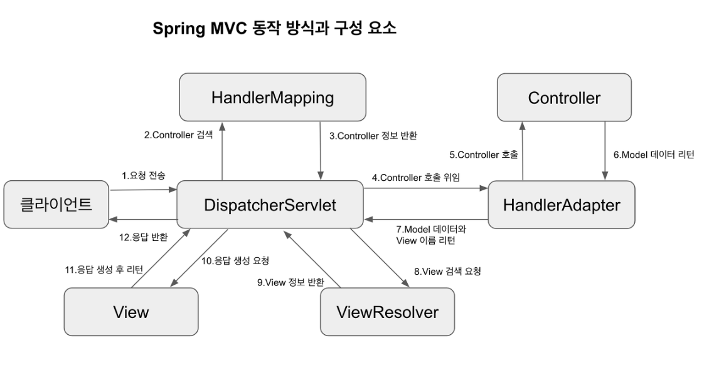

# Spring 개념 정리

## Spring 헷갈리는 개념 정리

**servlet-context.xml, root-context.xml 차이**

* 수업 도중에 옆에 있던 동료가 spring legacy project 생성시 생성되는 servlet-context.xml, root-context.xml 차이점에 대해서 물어봤다.
* servlet-context는 controller 관련 로직, root-context는 service, repository 관련 빈 등록? 이라고만 알았는데 정확한 동작원리는 알고있지 못하기에 정리하고자 한다.

**동작원리**

1. context-param을 통해 root-context 설정을 합니다.
2. listener 태그의 ContextLoaderListener 클래스를 이용하여 contextConfigLocation에 있는 root-context들을 불러옵니다.
3. 클라이언트의 요청을 받으면 servlet 태그 안에 있는 설정들이 작동하면서 servlet-context와 root-context를 동시에 같이 불러오며 DispatcherServlet 클래스를 실행시킵니다.

**web.xml**

* servlet 태그 안에 DispatcherServlet과 함께 사용하면 servlet context의 설정 파일임을 명시한다.

```xml
<servlet>
    <servlet-name>appServlet</servlet-name>
    <servlet-class>org.springframework.web.servlet.DispatcherServlet</servlet-class>
    <init-param>
        <param-name>contextConfigLocation</param-name>
        <param-value>/WEB-INF/spring/appServlet/servlet-context.xml</param-value>
    </init-param>
    <load-on-startup>1</load-on-startup>
</servlet>
```

* servlet context 설정 파일을 DispatcherServlet의 contextConfigLocation으로 지정하고 있다.

```xml
<context-param>
    <param-name>contextConfigLocation</param-name>
    <param-value>/WEB-INF/spring/root-context.xml</param-value>
</context-param>

<listener>
    <listener-class>org.springframework.web.context.ContextLoaderListener</listener-class>
</listener>
```

* root context 설정 파일을 ContextLoaderListener의 contextConfigLocation으로 지정하고 있다.

**servlet-context.xml**

* servlet-context에 등록되는 빈들은 해당 컨테스트에서만 사용할 수 있습니다.
* **Controller, HandlerMaping, ViewResolver** 와 같은 웹과 연관되어 있는 bean들을 정의합니다.

**root-context.xml**

* root-context에서 등록되는 빈들은 모든 컨텍스트에서 사용할 수 있습니다. (공유 가능)
* **Repository, Service** 와 같은 여러 요청에 대해서 공유해야 하는 bean 들을 정의합니다.
* **servlet-context**내 빈들은 이용이 불가능합니다.

> root-context는 공유가 가능한 반면 servlet-context는 해당 컨텍스트 내에 있는 빈만 사용이 가능하다.
>
> servlet-context 는 컨트롤러 담당, root-context는 서비스와 레포지토리를 담당한다.

**Spring Web MVC Dispatcher Servlet 동작원리**

* Dispatcher Servlet을 알아보기전에 위에서 Spring servlet-context.xml, root-context.xml 설정을 알아보았는데 간략하게 알아보고 넘어가고자 합니다.

* context-param을 통해 contextConfigLocation을 root-context.xml을 설정한 뒤, ContextLoaderListener 클래스를 통해 contextConfigLocation 에 등록된 root-context들을 불러온 뒤, 클라이언트의 요청을 받으면 servlet 태그에서 설정들이 실행되며 root-context와 servlet-context를 동시 실행하며 Dispatcher Servlet이 동작하게됩니다.

* DispatcherServlet 은 HTTP 프로토콜로 들어오는 모든 요청을 가장 먼저 받아 적합한 컨트롤러에 보내주는 Front Controller 이다.



**동작 과정**

1. 클라이언트 요청을 Dispatcher Servlet이 받음.
2. DispatcherServlet은 Controller에 대한 검색을 HandlerMapping 인터페이스에게 요청하고 정보를 반환 받습니다.
3. DispatcherServlet은 HandlerAdapter를 통해 Controller를 호출합니다.
4. Controller는 비즈니스 모델을 처리한 후 데이터를 HadlerAdapter에게 반환합니다.
5. HandlerAdapter는 Model 데이터와 View 이름을 다시 DispatcherServlet에게 반환합니다.
6. DispatcherServlet은 받은 2개의 데이터 중에서 View 이름을 가지고 ViewResolver에게 해당 View 정보를 요청합니다.
7. ViewResolver는 응답할 View에 대한 파일을 찾아 DispatcherServlet에게 전달합니다.
8. DispatcherServlet은 응답할 뷰의 Render를 지시하고 View는 Model 데이터를 받아 로직을 처리합니다.
9. View는 응답 데이터를 생성해서 다시 DispatcherServlet에게 반환합니다.
10. DispatcherServlet은 View로 받은 응답데이터를 마지막으로 클라이언트에게 응답합니다.

**Controller, RestController 차이**

* 회원가입 예제를 구현하던 중 Controller을 통해 view 리턴하는 것이 일반적이었으나, Json 형태로 객체 데이터를 반환할 때는 무조건적으로 RestController를 사용하는 것? 이었나... 헷갈려서 개념을 정리하고자 합니다.
* **@RestController 란???**
    * @RestController는 **@Controller에 @ResponseBody**가 추가된 것입니다. 
    * @Controller는 Model 객체를 만들고 결과에 맞는 뷰 페이지를 리턴합니다.
    * @ResponseBody는 HTTP Response Body에 데이터를 담아 리턴합니다.
    * 주용도는 Json 형태로 객체 데이터를 반환할 때 사용합니다.
    * 데이터를 응답으로 제공하는 REST API를 개발할 때 주로 사용하며 일반적으로 객체를 ResponseEntity로 감싸서 반환할 수도 있습니다.
    * 객체를 반환하기 위해서는 view resolver 대신에 HttpMessageConverter가 동작합니다.
    * 즉, spring4이전에는 아래와 같이 @Controller와 @ResponseBody 어노테이션을 같이 사용했다면 이후 버전은 @RestController로 Restful하게 사용합니다.

```java
@Controller
@ResponseBody
public class MVCController{
    ...
}

@RestController
public class RestFulController{
    ...
}
```

**Spring ResponseEntity 클래스**

* 게시판 예제중에 반환타입을 ResponseEntity로 반환하는 예제가 많이 보여서 무엇인지 정리하고자합니다.
* REST API를 만들 때 클라이언트와 서버 간의 통신에 필요한 정보를 제공하는 경우 ResponseEntity를 사용하면 상태 코드와 응답 헤더 및 응답 본문을 생성해서 클라이언트에 전달할 수 있습니다.

> 즉, httpentity를 상속받으며, 결과 데이터와 HTTP 상태 코드, 헤더값을 모두 프론트로 넘겨줄 수 있다는 장점이 있다.

* 밑의 예제를 통해서 ResponseEntity 사용법에 대해서 알아보자.

```java
// 이메일 인증번호 확인
@PostMapping("/checkMailCode")
public ResponseEntity<String> checkMailCode(String inputCode) {
    try {

        if (code == Integer.parseInt(inputCode)) {
            return ResponseEntity.ok("Y");
        } else {
            return ResponseEntity.status(HttpStatus.BAD_REQUEST).body("N");
        }
    } catch (Exception e) {
        e.printStackTrace();
        return ResponseEntity.status(HttpStatus.INTERNAL_SERVER_ERROR).body("N");
    }
}
```

* 조건문을 통해 입력한 데이터의 value와 code 데이터를 비교하여 프론트인 jsp 로 Y의 결과를 보내서 사용한 예제입니다.
* ok가 아니라 잘못된 클라이언트 요청이 들어오면 ResponseEntity.status(HttpStatus.BAD_REQUEST).body("N") 를 통해 상태 코드 조작을 통해 사용할 수 있습니다.

**Spring RedirectAttributes Interface**

* RedirectAttributes 인터페이스는 스프링 3.1 버전 이 후 출시된 redirect시 데이터를 전달할 수 있는 방법이다.
* RedirectAttributes는 크게 addAttribute 와 addFlashAttribute 두 가지가 있다.

1. addAttribute 사용

```java
@RequestMapping(value="/aaa/bbb/ddd.do", method =RequestMethod.POST)
public String insertAaaaaaaaaa(ModelMap model, RedirectAttributes rttr) throws Exception{
    
    String message ="등록되었습니다.";
    rttr.addAttribute("message", message);
     
    return "redirect:/aaa/bbb/ccc.do";
}
```

* addAttribute를 사용하면 String 문자열을 사용하여 데이터를 전달할 수 있다.

```java
/aaa/bbb/ccc.do?message=등록되었습니다.
```

2. addFlashAttribute 사용

```java
@RequestMapping(value="/aaa/bbb/ddd.do", method =RequestMethod.POST)
public String insertAaaaaaaaaa(ModelMap model, RedirectAttributes rttr) throws Exception{
    
    String message ="등록되었습니다.";
    rttr.addFlashAttribute("message", message);
    
    return "redirect:/aaa/bbb/ccc.do";
}
```

* addFlashAttribute의 경우 post 형식으로 데이터를 전달할 수 있으며 데이터는 한번만 사용된다.(새로고침을 해도 한번만 나오기에 게시판의 경우에 유용하게 사용 가능하다.)
* 사용할 jsp 파일에서는 EL 표현식을 써서 아래와 같이 사용 가능하다.

```jsp
${message}
```

* 또한 addFlashAttribute 는 String 뿐만 아니라 Object도 사용가능하다. Object를 사용하는 방법은 아래와 같다.

```java
@RequestMapping(value="/aaa/bbb/ddd.do", method =RequestMethod.POST)
public String insertAaaaaaaaaa(ModelMap model, RedirectAttributes rttr) throws Exception{
    
    String message ="등록되었습니다.";
    rttr.addFlashAttribute("aaaaVO", aaaaVO)
    
    return "redirect:/aaa/bbb/ccc.do";
}

public String aaaa(HttpServletRequest request) throws Exception{
        
    Map<String, ?> flashMap =RequestContextUtils.getInputFlashMap(request);
    
    if(flashMap!=null) {
        
        aaaaVO =(AaaaVO)flashMap.get("aaaaVO");
    }
        
    return ".......";
}
```

* 데이터를 받을 때는 RequestContextUtils.getInputFlashMap(request) 와 같이 사용하자. 

**MockMvc**

* 호돌맨 강의를 보다가 MockMvc 란 기능을 써서 알아보고 사용하고자 합니다.
* 기존에는 Junit5 에 있는 assert 메서드 기능으로만 테스트케이스를 진행했었는데 MovcMVc를 사용하면 HTTP 요청을 모의(Mock) 함으로써 응답을 검증할 때 테스트할 수 있습니다.

* MockMvc 란?
    * 서버의 MVC 동작을 테스트 할 수 있는 라이브러리입니다.
    * 실제 객체와 비슷하게 사용하지만 테스트에 필요한 기능만 가지는 가짜 객체를 만들어 스프링 MVC 동작을 재현할 수 있는 클래스입니다.
    * 주로 Controller 단위테스트에 많이 사용됩니다.

* MockMvc는 크게 **세 가지 동작**을 갖습니다.
    * **perform** 
        * 가상의 request(요청)을 처리한다.
        * request(요청)은 MockHttpServletRequestBuilder를 통해서 생성된다.
    * **except**
        * 가상의 response에 대해서 검증한다.
        * 검증항목은 아래와 같다.
        * handler()
        * status()
        * model()
        * view()
        * 위 메서드들은 ResultMatcher를 반환한다.
    * **do**
        * 테스트 과정에서 직접 처리할 일을 작성한다.
        * 실제 동작은 ResultHandler를 사용한다.

```java
@WebMvcTest
class PostControllerTest {

    @Autowired
    private MockMvc mockMvc;

    @Test
    @DisplayName("/posts 요청시 Hello World 출력")
    void test() throws Exception {
        // expected
        mockMvc.perform(get("/posts"))
                .andExpect(status().isOk())
                .andExpect(content().string("Hello World"))
                .andDo(print());
    }
}
```

* 추상 클래스 MockMvcRequestBuilders 에서 사용하는 MockHttpServletRequestBuilder 를 사용하여 get을 통해 지정한 URI로 요청을 보냅니다.
* assertThat 사용법과 유사하게 특정 결과가 나타나도록 MockMvcResultMatchers 에서 사용하는 andExpect 를 사용하여 status와 content 를 검증합니다.
* andDo 를 통해 Get 요청의 결과를 콘솔에 출력합니다.
* 위와 같이 사용했을 때 테스트 결과는 아래와 같이 나옵니다.

```java
MockHttpServletResponse:
           Status = 200
    Error message = null
          Headers = [Content-Type:"text/plain;charset=UTF-8", Content-Length:"11"]
     Content type = text/plain;charset=UTF-8
             Body = Hello World
    Forwarded URL = null
   Redirected URL = null
          Cookies = []
```

**BindingResult**

* BindingResult는 Error를 상속받은 데이터 검증을 하기위한 인터페이스입니다.
* 주사용법은 Error interface안에 hasErrors() 메서드를 사용하여 검증합니다.
* 아래 코드 예시를 통해 알아보겠습니다.

```java
@PostMapping("/posts")
    public Map<String, String> post(@RequestBody @Valid PostCreate params, BindingResult result) throws Exception {

        if(result.hasErrors()){
            var fieldErrors = result.getFieldErrors();
            FieldError firstFieldErrors = fieldErrors.get(0);
            String fieldName = firstFieldErrors.getField(); // title
            String errorMsg = firstFieldErrors.getDefaultMessage(); // 에러메시지

            Map<String, String> error = new HashMap<>();
            error.put(fieldName, errorMsg);
            return error;
        }
        return Map.of();

    }
```

* 테스트케이스에서 에러가 발생하면 BindingResult 로 인해 spring 내에서 400에러가 발생합니다.
* result.hasErros 를 통해 에러가 존재한다면 모든 에러를 List형식으로 fieldErrors 변수에 담습니다.
* FieldError 클래스를 통해 첫번째 값을 꺼내와 firstFieldErrors 변수에 담습니다.
* firstFieldErrors 변수를 통해 Field와 DefaultMessage를 통해 Map에 담아 error를 반환합니다.

**Map.of()**

* Map.of() 는 자바 9부터 사용할 수 있는 key와 value를 최대 10개까지 넣을 수 있는 메서드를 지원합니다.
* unmodifiable map 을 리턴하며 맵 데이터를 초기화하는 경우에 간단하게 작성 가능합니다.

```java
Map<Integer, String> map = Map.of(1, "first", 2, "second");

map.forEach((k,v) -> System.out.println(k + " - " + v));
```

* 위와 같이 작성하면 put 메서드 사용할 필요 없이 간단하게 작성가능하나 Map.of 에는 단점이 존재합니다.

1. 10개의 개수 제한

```java
static <K, V> Map<K, V> of(K k1, V v1, K k2, V v2, K k3, V v3, K k4, V v4, K k5, V v5,
                            K k6, V v6, K k7, V v7, K k8, V v8, K k9, V v9, K k10, V v10) {
    return new ImmutableCollections.MapN<>(k1, v1, k2, v2, k3, v3, k4, v4, k5, v5,
                                            k6, v6, k7, v7, k8, v8, k9, v9, k10, v10);
}
```

* Map 인터페이스내에 Map.of 는 인자의 개수에 맞추어 오버로딩하고 있기 때문에 10개가 넘어가는 데이터에 추가할 경우 에러를 발생시킵니다.

2. Immutable 객체 반환

* Map.of() 나 Map.ofEntries() 를 통해 객체를 초기화할 때는 Immutable 객체를 반환합니다.
* 초기화가 되고 난 이후 put이나 remove를 통해 객체의 데이터를 변경시킬 수 없습니다.