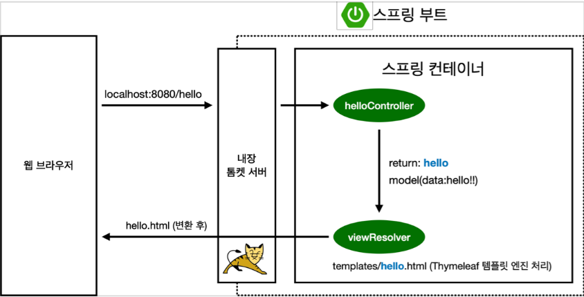

# View 환경설정

스프링부트는 resources/static/index.html 에 넣어두면 welcome 페이지로 만들어줍니다.



```java

// HelloController
@Controller
public class HelloController {

    @GetMapping("hello")
    public String hello(Model model){
        model.addAttribute("data", "hello!!");
        return "hello";
    }
}

// hello.html
<!DOCTYPE HTML>
<html xmlns:th="http://www.thymeleaf.org">
<head>
    <title>Hello</title>
    <meta http-equiv="Content-Type" content="text/html; charset=UTF-8" />
</head>
<body>
<p th:text="'안녕하세요. ' + ${data}" >안녕하세요. 손님</p>
</body>
</html>
```

**동작흐름**

1. 웹 브라우저에서 localhost:8080/hello 를 호출하면 톰켓 서버가 이를 받는다.
2. spring의 HelloController에서 hello 로 Get 요청을 받으면 String hello 메서드 실행된다.
3. model.addattribute 으로 key, value 형식의 data에 hello!! 를 넣는다.
4. springboot는 리턴 값으로 문자를 반환하면 viewResolver 라는 것이 화면을 찾아서 처리한다.
    * resources:templates/ + (ViewName) + .html
5. 따라서 hello.html 의 파일이 호출되며 화면에 나온다.