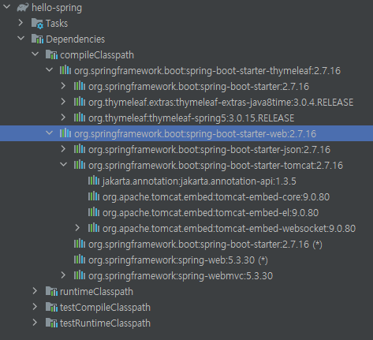

# 라이브러리 살펴보기

## Gradle은 의존관게가 있는 라이브러리를 함께 다운로드 한다.

build.gradle 파일에 들어가면 

```java
dependencies {
	implementation 'org.springframework.boot:spring-boot-starter-thymeleaf'
	implementation 'org.springframework.boot:spring-boot-starter-web'
	testImplementation 'org.springframework.boot:spring-boot-starter-test'
}
```

위와 같이 설정되어 있는 모습을 볼 수 있다.

**스프링부트 라이브러리**
* spring-boot-starter-web 
    * spring-boot-starter-tomcat: 톰캣 (웹서버) 
    * spring-webmvc: 스프링 웹 MVC
* spring-boot-starter-thymeleaf: 타임리프 템플릿 엔진(View) 
* spring-boot-starter(공통): 스프링 부트 + 스프링 코어 + 로깅 
  * spring-boot
    * spring-core 
* spring-boot-starter-logging 
  * logback, slf4j

**테스트 라이브러리**
* spring-boot-starter-test 
  * junit: 테스트 프레임워크 
  * mockito: 목 라이브러리 
  * assertj: 테스트 코드를 좀 더 편하게 작성하게 도와주는 라이브러리 
  * spring-test: 스프링 통합 테스트 지원



Gradle 왼쪽 하단 설정에서 Dependencies 에 들어가면 이와 의존된 라이브러리들을 확인할 수 있습니다.