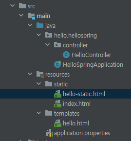
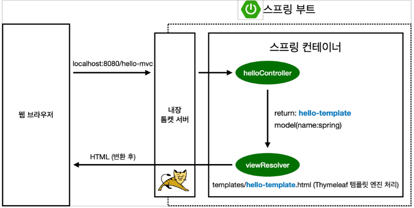
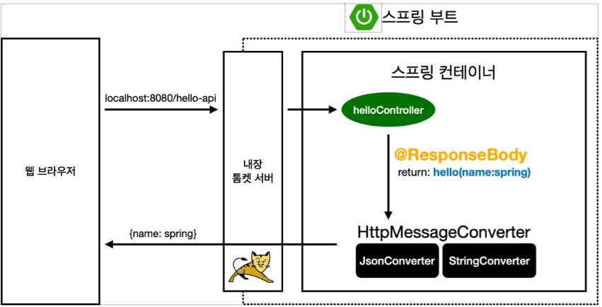

# 정적 컨텐츠 

스프링 부트 정적 컨텐츠 기능
https://docs.spring.io/spring-boot/docs/2.3.1.RELEASE/reference/html/spring-boot-features.html#boot-features-spring-mvc-static-content



```java
// hello-static.html 파일

<!DOCTYPE HTML>
<html>
<head>
    <title>static content</title>
    <meta http-equiv="Content-Type" content="text/html; charset=UTF-8" />
</head>
<body>
정적 컨텐츠 입니다.
</body>
</html>
```


**동작흐름**

1. hello-static.html 을 호출하면 내장 톰켓 서버가 요청을 받습니다.
2. 톰켓이 스프링에게 요청을 넘기고 Controller에 해당 파일을 우선 찾아봅니다.
3. 스프링은 resources: static 파일에 있는 hello-static.html 이 있으면 이를 반환해줍니다.

hello-static.html 은 정적인 내부파일만 사용가능합니다.

# MVC와 템플릿 엔진

템플릿 엔진이란 HTML을 서버에서 동적으로 바꾸어 내려주는것. ex)jsp
MVC : Model, View, Controller

```java
@Controller
public class HelloController {

    ...

    @GetMapping("hello-mvc")
    public String helloMvc(@RequestParam(value = "name", required = false) String name, Model model){
        model.addAttribute("name", name);
        return "hello-templates";
    }
}

// hello-templates 파일
<html xmlns:th="http://www.thymeleaf.org">
<body>
<p th:text="'hello ' + ${name}">hello! empty</p>
</body>
</html>
```

@RequestParam 은 사용자가 전달하는 값을 1:1 로 매핑해주는 어노테이션입니다. 외부에서 파라미터를 name으로 받아옵니다.
required 기능은 기본이 true이므로 false로 해주면 key값이 없다고해서 예외를 발생시키지 않습니다.



**동작흐름**

1. hello-mvc 를 호출하면 내장 톰켓 서버가 스프링에게 요청을 전달합니다. 
2. 스프링은 helloController 내에서 매핑이 되어있으므로 메서드를 호출하며 hello-templates 를 리턴해줍니다.
3. model에서는 키는 name으로 값은 spring으로 작동합니다.
4. viewResolver가 templates/hello-templates.html 을 Thymeleaf 템플릿 엔진에게 처리를 맡깁니다.
5. 템플릿 엔진이 렌더링을 해서 변화를 한 html 파일을 웹 브라우저에게 넘깁니다.

# API

JSON 포맷형식으로 클라이언트에 전달하는 것을 일방적인 API 방식이라고 합니다.

```java
@Controller
public class HelloController {

    ...

    // 문자 그대로 반환
    @GetMapping("hello-string")
    @ResponseBody
    public String helloString(@RequestParam String name) {
        return "hello " + name;
    }

    // 객체 반환 시 JSON형태로 반환
    @GetMapping("hello-api")
    @ResponseBody
    public Hello helloApi(@RequestParam("name") String name){
        Hello hello = new Hello();
        hello.setName(name);
        return hello;
    }

    static class Hello {
        private String name;

        public String getName() {
            return name;
        }

        public void setName(String name) {
            this.name = name;
        }
    }
}
```
@ResponseBody는 HTTP의 Body에 문자 내용을 직접 반환합니다.
문자를 반환하면 문자 그대로의 형식이 나오나 객체를 반환하면 JSON 형식으로 변환된 결과가 나옵니다.



**동작흐름**

1. hello-api 요청을 스프링에게 전달합니다.
2. @ResponseBody 어노테이션이 붙어있으면 HttpMessageConverter가 동작합니다.
3. HttpMessageConverter가 문자면 StringConverter, 객체면 JsonConverter 가 동작합니다.
4. 동작한 결과를 브라우저에 넘깁니다.

## 요약

> 정적컨텐츠 : 그냥 파일을 내려준다.
>
> MVC와 템플릿 엔진 : 템플릿 엔진을 MVC로 쪼개서 ViewResolver를 통해 렌더링된 Html을 클라이언트에게 전달하는 방식이다.
>
> API : 객체를 반환하면 JSON형식으로 사용한다.