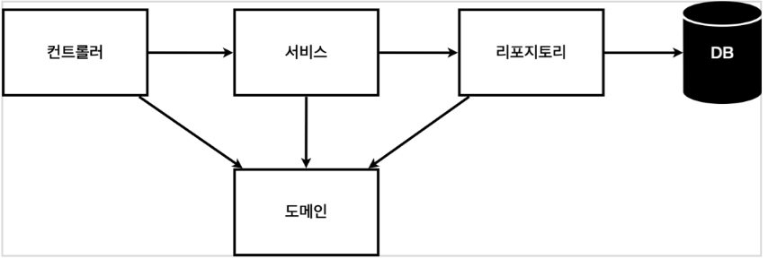
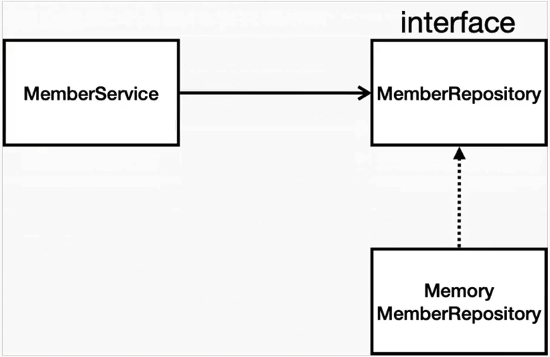

# 비즈니스 요구사항 정리

* 데이터 : 회원ID, 이름
* 기능 : 회원 등록, 조회
* 아직 데이터 저장소가 선정되지 않음

**일반적인 웹 어플리케이션 계층 구조**



* 컨트롤러 : 웹 MVC의 컨트롤러 역할
* 서비스 : 핵심 비즈니스 로직 구현
* 리포지토리 : 데이터베이스에 접근, 도메인 객체를 DB에 저장하고 관리
* 도메인 : 비즈니스 도메인 객체 ex) 회원, 주문, 쿠폰 등등.. 주로 데이터베이스에 저장하고 관리됨.

**클래스 의존관계**



# 회원 도메인과 리포지토리 만들기

## domain 패키지 생성 후 Member 클래스 생성

```java
public class Member {

    private Long id;        // 시스템이 저장하는 id
    private String name;    

    public Long getId() {
        return id;
    }

    public void setId(Long id) {
        this.id = id;
    }

    public String getName() {
        return name;
    }

    public void setName(String name) {
        this.name = name;
    }
}
```

## repository 패키지내에 interface로 MemberRepository 생성

```java
public interface MemberRepository {
    Member Save(Member member);
    Optional<Member> findById(Long id);         
    Optional<Member> findByName(String name);
    List<Member> findAll();

}
```

* Optional 기능은 자바 8에서 제공하는 기능입니다.
* 값이 없을 경우에는 null 값을 값이 있는 경우에는 값을 꺼내는 기능을 지원합니다.

## repository 패키지내에 구현체인 MemeryMemberRepository 생성하여 MemberRepository 구현

```java
public class MemoryMemberRepository implements MemberRepository{

    private static Map<Long, Member> store = new HashMap<>();
    private static long sequence = 0L;

    @Override
    public Member Save(Member member) {
        member.setId(++sequence);
        store.put(member.getId(), member);
        return member;
    }

    @Override
    public Optional<Member> findById(Long id) {
        return Optional.ofNullable(store.get(id));
    }

    @Override
    public Optional<Member> findByName(String name) {
        return store.values().stream()
                .filter(member -> member.getName().equals(name))
                .findAny();
    }

    @Override
    public List<Member> findAll() {
        return new ArrayList<>(store.values());
    }

    public void clearStore(){
        store.clear();
    }
}
```

* Save 메서드를 사용할 때 멤버의 Id는 sequence가 1씩 증가하며, map 으로 정의해둔 store에 멤버의 Id를 넣습니다.
* findById 메서드를 사용할 떄 null 처리를 위한 Optional.ofNullable 사용합니다.
* findByName 메서드를 사용할 때 store에 있는 값들을 파라미터로 넘어온 name과 같을 경우 .findAny() 를 통해 결과를 찾습니다.
* findAll 메서드를 사용할 때 반환을 ArrayList<>에 store에 있는 member의 values를 반환합니다.
* clearStore은 테스트 케이스 작성 후 map에 저장되어있는 값을 비워주기위함입니다.