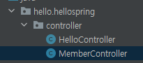
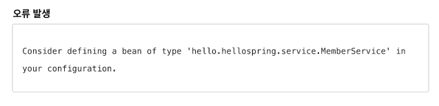
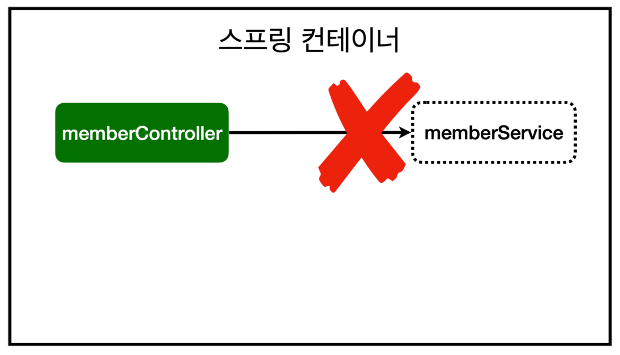
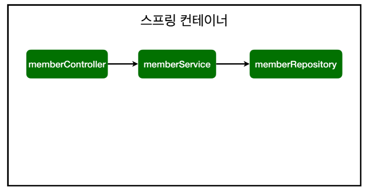

#  컴포넌트 스캔과 자동 의존관계 설정

* 지금까지의 흐름은?
  * Member객체를 만들고 MemberRepository와, MemberService를 구현하였고 Service를 통해서 member를 가입하고, repository에 저장이되어지고 가져와서 사용할 수 있습니다.
* 앞으로 화면을 같이 사용하려면 컨트롤러와 view가 필요합니다.

* MemberController 를 생성할 때는 MemberService를 통해서 회원가입하고, 데이터를 조회할 수 있어야합니다.
* 이를 Controller가 Service를 의존한다고 표현합니다.
* 이 작업을 Spring은 어떻게 하는지 알아보자.

## controller 패키지내에 MemberController 생성



* 어노테이션 @Controller를 붙이면 생기는 일에 대해서 알아보자.
  * Spring 이 구동되면 Container 라는 것이 생깁니다.
  * 이곳에 MemberController 객체를 생성해서 Spring이 관리하고 넣어둡니다.
  * 이를 Spring Container에서 Spring Bean이 관리된다고 말합니다.

```java
@Controller
public class MemberController {

    private final MemberService memberService = new MemberService();
}
```

* new로 객체를 생성해서 사용할 수도 있으나 왜 이렇게 안할까?
* 이는 Spring이 관리하므로 Container로 관리하고 Container 로 바꿔서 사용해줘야 합니다.
* 왜냐하면 new해서 사용했을 때 MemberContainer가 아닌 다른 곳에서 memberservice를 가져다 사용할 수도 있기 때문입니다.
  * ex) 주문 컨트롤러에서도 가져다 쓸 수도 있습니다.
* 하나만 생성해서 같이 공용으로 쓰는게 맞으므로 코드를 스프링 Container에 등록하고 써줄 수 있도록 수정해줍니다. 
  * (이전까지는 개발자가 직접 주입했고, @Autowired 는 스프링이 주입해주는 것)

```java
@Controller
public class MemberController {

    private final MemberService memberService;

    @Autowired
    public MemberController(MemberService memberService) {
        this.memberService = memberService;
    }
}
```

* MemberController 는 Spring Container가 뜰 때 생성을 할 떄 생성자를 호출합니다.
* 이 때 생성자에 @AutoWired 어노테이션이 붙어있으면 memberService를 Spring Container에 있는 memberService를 가져다 연결해줍니다.
* 하지만 서버를 구동시키면 이러한 에러가 나옵니다.



* 이유는 **memberService가 스프링 빈으로 등록되어 있지 않기 때문입니다.**
  *  (helloController는 스프링이 제공하는 컨트롤러이므로 자동 등록됩니다.)



* **스프링 빈을 등록하는 방법은 2가지 방법이 있습니다.**
  1. 컴포넌트 스캔과 자동 의존관계 설정
      * @Component 에는 @Controller, @Service, @Repository가 있는데 각자의 역할을 주기위함. 역할은 동일합니다.
  2. 자바 코드로 직접 스프링 빈 등록하기

## 컴포넌트 스캔과 자동 의존관계 설정

```java
@Service
public class MemberService {...}

@Repository
public class MemoryMemberRepository implements MemberRepository{...}
```

* @Service 어노테이션을 MemberService 클래스에 사용하면 Spring Container에 MemberService를 등록해줍니다. 
* 마찬가지로 @Repository 어노테이션도 Container에 담깁니다.
* 이는 Spring의 정형화된 패턴으로 공식과 같습니다.
  * Controller을 통해 외부요청을 받고, Service에서 비즈니스 로직을 생성하고, Repository에서 데이터를 저장합니다.
* 이를 자세하게 알아보겠습니다.



* 위에서 어노테이션을 사용하여 memberService와 memberRepository가 스프링 컨테이너에 스프링 빈으로 등록되었습니다.
* 생성자에서 @Autowired를 하면 MemberController가 생성될 때 Spring Bean에 등록되어있는 memberService 객체를 가져다 넣어되는데,
  * 이를 Dependency Injection(의존성 주입) 이라고 합니다.

```java
@Service
public class MemberService {

    private final MemberRepository memberRepository;

    @Autowired
    public MemberService(MemberRepository memberRepository) {
        this.memberRepository = memberRepository;
    }
```

* Controller와 마찬가지로 MemberService에서도 Spring이 생성을 할 때 @Service 어노테이션을 보고 생성자를 호출합니다.
* 이 때 @Autowired가 있으므로 memberRepository가 필요하다고 알고 Container에 있는 memberRepository를 넣어줍니다.

### 컴포넌트 스캔과 자동 의존관계 설정 정리

> 컴포넌트 스캔(@Controller, @Service, @Repository)이 붙어 있으면 객체를 생성하여 Spring Container에 담깁니다.
>
> @Autowired 는 MemberController가 memberService를 쓸 수 있게 해주고, memberService가 memberRepository가 쓸 수 있게 해줍니다.

## 자바 코드로 직접 스프링 빈 등록하기

```java
public class MemberService {...}

public class MemoryMemberRepository implements MemberRepository{...}
```

* 컴포넌트 스캔을 통한 방법이 아닌 직접 스프링 빈 등록을 위해서 어노테이션을 제거하고 서버를 실행하면 저번에 알아보았듯이 MemberService 객체를 찾을 수 없다는 에러가 나옵니다.
* 컴포넌트 스캔 대신에 직접 스프링 빈 등록하는 방법을 알아보겠습니다.

```java
@Configuration
public class SpringConfig {

    @Bean
    public MemberService memberService(){
        return new MemberService(memberRepository());
    }

    @Bean
    public MemberRepository memberRepository(){
        return new MemoryMemberRepository();
    }
}
```

* @Configuration 어노테이션이 붙어있으면 Spring Bean에 등록하는 것으로 Spring이 인식해서 로직을 호출합니다.
* @Bean 어노테이션을 활용해서 MemberService와 MemberRepository를 스프링 빈에 등록해줍니다. 
* 이렇게 작성하면 컴포넌트 스캔에서 설정한 것과 같이 정상적으로 동작합니다.

### 컴포넌트 스캔, 직접 스프링 빈 등록 장단점 및 개념 정리

> DI에는 필드, setter, 생성자 주입 세 가지가 있는데 스프링 컨테이너가 조립되는 시점에 생성자로써 한번만 호출하도록 하는게 좋습니다.
>
> 실제로 실무에서는 주로 정형화된 컴포넌트 스캔을 사용합니다. 상황에 따라 구현 클래스를 변경해야 할 경우 스프링 빈으로 등록합니다.
>
> Spring Bean으로 등록되어있지 않으면 @Autowired는 동작하지 않습니다.