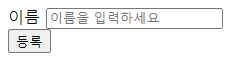
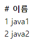

#  웹 MVC 개발

## 회원 웹 기능 - 홈 화면 추가

### controller 패키지내에 HomeController 생성

```java
@Controller
public class HomeController {

    @GetMapping("/") // localhost 8080 접속 시 이것이 호출됨.
    public String home(){
        return "home";
    }
}
```

### templates 패키지내에 home.html 생성

```html
<!DOCTYPE HTML>
<html xmlns:th="http://www.thymeleaf.org">
<body>
<div class="container">
    <div>
        <h1>Hello Spring</h1>
        <p>회원 기능</p>
        <p>
            <a href="/members/new">회원 가입</a>
            <a href="/members">회원 목록</a>
        </p>
    </div>
</div> <!-- /container -->
</body>
</html>
```

* 이전에 resources/static/index.html 에서 아무것도 없으면 이 페이지로 가는 것이 맞습니다.
* 하지만 정적컨텐츠부분에서 설명했듯이 스프링에서 관련 컨트롤러가 있는지 찾고나서 없었을 때만 hello-static 을 호출하기 때문입니다.
* 회원 가입, 회원 목록 기능을 이어서 만들어보록 하겠습니다.

## 회원 웹 기능 - 등록

```java
@Controller
public class MemberController {

    ...

    @GetMapping("/members/new")
    public String createForm(){
        return "members/createMemberForm";
    }
}
```

* home.html 파일내에서 회원 가입 링크를 클릭하면 주소가 /members/new 로 이동하므로 @GetMapping 이노테이션에 같은 링크를 적어줍니다.
* return 값으로는 members/createMemberForm 파일을 호출합니다.

### templates 패키지내에 createMemberForm.html 생성

```html
<!DOCTYPE HTML>
<html xmlns:th="http://www.thymeleaf.org">
<body>
<div class="container">
  <form action="/members/new" method="post">
    <div class="form-group">
      <label for="name">이름</label>
      <input type="text" id="name" name="name" placeholder="이름을
입력하세요">
    </div>
    <button type="submit">등록</button>
  </form>
</div> <!-- /container -->
</body>
</html>
```

* /member/new 호출을 받고 return 값으로 위의 createMemberForm.html 파일이 호출됩니다.

### controller 패키지내에 MemberForm 생성

```java
public class MemberForm {
    private String name;

    public String getName() {
        return name;
    }
    public void setName(String name) {
        this.name = name;
    }
}
```

* MemberForm에 정의한 name과 createMemberForm 에 정의한 name이 매칭되어 들어오게됩니다.

```java
@Controller
public class MemberController {

    private final MemberService memberService;

    @Autowired
    public MemberController(MemberService memberService) {
        this.memberService = memberService;
    }

    @PostMapping("/members/new")
    public String create(MemberForm form){
        Member member = new Member();
        member.setName(form.getName());

        memberService.join(member);

        return "redirect:/";
    }
}
```



* 이름을 등록하면 정상적으로 완료됩니다.

**동작흐름**

1. localhost:8080 접속하면 HomeController에 @GetMapping("/") 을 명시하고있기 때문에 return 값으로 "home" 을 받아서 home.html로 이동합니다.
2. home.html에서 링크가 /members/new 인 회원가입으로 이동하게 되는데 이 때의 @GetMapping("/members/new") 가 명시되어있어 return 값으로 "members/createMemberForm" 을 받아 이동합니다.
3. form 태그안에서 action에 명시해놓은 /members/new 를 method에 명시해놓은 post방식으로 넘어옵니다.
4. 이는 MemberController에서 @PostMapping("/members/new") 에서 명시해놓은 곳에서 받습니다.
    * PostMapping은 데이터를 폼같은데 넣어서 전달할 때 쓰임.
    * Get은 주로 조회할 때 쓰임.
5. create 메서드가 호출되며 매개변수로 MemberForm 을 받는데 MemberForm에 name에 input에서 적어놓은 name이 들어오게됩니다.
6. setName을 통해서 form에서 받은 name을 form.getName() 메서드를 통해서 member 객체에 저장하고, memberService에 정의한 join 메서드로 member객체를 저장합니다. 

## 회원 웹 기능 - 조회

```java
@Controller
public class MemberController {

    private final MemberService memberService;

    @Autowired
    public MemberController(MemberService memberService) {
        this.memberService = memberService;
    }

    ...

    @GetMapping("/members")
    public String list(Model model){
        List<Member> members =  memberService.findMembers();
        model.addAttribute("members", members);
        return "members/memberList";
    }
}
```

* 뷰, 등록 화면을 통해 동작흐름을 알고나니 조회는 안보고 작성할 수 있을만큼 쉽다.
* members @GetMapping을 받으면 members 의 참조변수에 리스트로 모든 멤버의 객체를 담습니다.
* 그 후 members/memberList 로 return 합니다.

```html
<!DOCTYPE HTML>
<html xmlns:th="http://www.thymeleaf.org">
<body>
<div class="container">
    <div>
        <table>
            <thead>
            <tr>
                <th>#</th>
                <th>이름</th>
            </tr>
            </thead>
            <tbody>
            <tr th:each="member : ${members}">
                <td th:text="${member.id}"></td>
                <td th:text="${member.name}"></td>
            </tr>
            </tbody>
        </table>
    </div>
</div> <!-- /container -->
</body>
</html>
```

* thymeleaf 의 템플릿문법에서 model 안에 members 안에 있는 리스트를 루프돌면서 첫번 째 객체를 member에 담습니다.(like 자바의 forEach 문법)
* 이 후 member객체의 id와 name을 get해와서 값을 출력해줍니다.



> 정상동작합니다. 하지만 서버를 껐다가 키면 메모리안에 있기 때문에 데이터는 사라지는게 당연합니다.
>
> 이를 위해서 데이터베이스에 접근하는 방법에 대해서 알아보겠습니다.