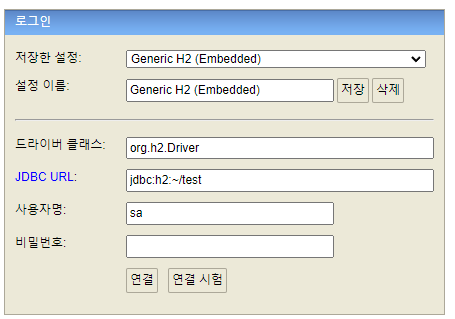
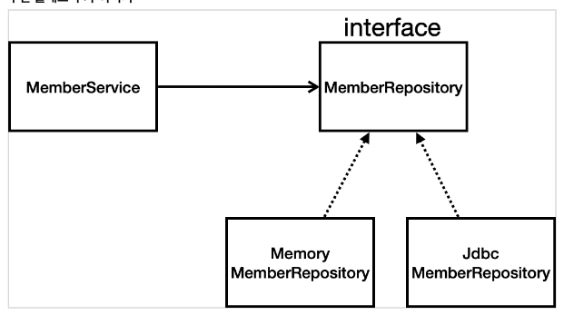
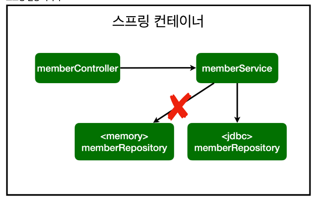

# 스프링 DB 접근 기술

## H2 데이터베이스 설치

* 1.4.200 버전 설치
* C:\h2\bin 경로에서 h2.bat 실행



* JDBC URL: 파일경로입력
* 이후 접속은 jdbc:h2:tcp://localhost/~/test 경로에서 접속

```sql
drop table if exists member CASCADE; 
create table member 
( 
    id   bigint generated by default as identity, 
    name varchar(255), 
    primary key (id) 
);
```

* MEMBER 테이블 생성
* generated by default as identity 값을 세팅하지 않았을 때 자동으로 null값 생성됩니다.
* insert into member(name) values('spring'); insert into member(name) values('spring2');
  * 테이블에 ID는 1씩 증가되고 name은 spring1, spring2로 생성해줍니다.
* sql 에서 ddl은 따로 directory 내에 파일을 생성해서 관리합니다. (DB 관리)

# 순수 JDBC

* build.gradle 파일에 jdbc, h2 데이터베이스 관련 라이브러리를 추가합니다.

```java
implementation 'org.springframework.boot:spring-boot-starter-jdbc' 
runtimeOnly 'com.h2database:h2'
```

* db랑 연결할 때 jdbc 드라이버, db는 h2로 연결하기위한 라이브러리 추가
* application.properties 파일내에

```java
spring.datasource.url=jdbc:h2:tcp://localhost/~/test
spring.datasource.driver-class-name=org.h2.Driver
```

* h2 DB를 연결하기위한 url 주소를 설정합니다.
* 기존에 MemoryMemberRepository와 연결하던 작업을 -> JdbcMemberRepostiory에서 연결을 바꿔서 작업합니다.
  * MemberRepository를 인터페이스로 구현했기에 바꿔주기만하면 사용가능합니다.

```java
package hello.hellospring.repository;

import hello.hellospring.domain.Member;
import org.springframework.jdbc.datasource.DataSourceUtils;

import javax.sql.DataSource;
import java.sql.*;
import java.util.ArrayList;
import java.util.List;
import java.util.Optional;

public class JdbcMemberRepository implements MemberRepository{

    private final DataSource dataSource;

    public JdbcMemberRepository(DataSource dataSource) {
        this.dataSource = dataSource;
    }

    @Override
    public Member Save(Member member) {
        String sql = "insert into member(name) values(?)";
        Connection conn = null;
        PreparedStatement pstmt = null;
        ResultSet rs = null;
        try {
            conn = getConnection();
            pstmt = conn.prepareStatement(sql,
                    Statement.RETURN_GENERATED_KEYS);
            pstmt.setString(1, member.getName());
            pstmt.executeUpdate();
            rs = pstmt.getGeneratedKeys();
            if (rs.next()) {
                member.setId(rs.getLong(1));
            } else {
                throw new SQLException("id 조회 실패");
            }
            return member;
        } catch (Exception e) {
            throw new IllegalStateException(e);
        } finally {
            close(conn, pstmt, rs);
        }
    }

    @Override
    public Optional<Member> findById(Long id) {
        String sql = "select * from member where id = ?";
        Connection conn = null;
        PreparedStatement pstmt = null;

        ResultSet rs = null;
        try {
            conn = getConnection();
            pstmt = conn.prepareStatement(sql);
            pstmt.setLong(1, id);
            rs = pstmt.executeQuery();
            if(rs.next()) {
                Member member = new Member();
                member.setId(rs.getLong("id"));
                member.setName(rs.getString("name"));
                return Optional.of(member);
            } else {
                return Optional.empty();
            }
        } catch (Exception e) {
            throw new IllegalStateException(e);
        } finally {
            close(conn, pstmt, rs);
        }
    }

    @Override
    public Optional<Member> findByName(String name) {
        String sql = "select * from member where name = ?";
        Connection conn = null;
        PreparedStatement pstmt = null;
        ResultSet rs = null;
        try {
            conn = getConnection();
            pstmt = conn.prepareStatement(sql);
            pstmt.setString(1, name);
            rs = pstmt.executeQuery();
            if(rs.next()) {
                Member member = new Member();
                member.setId(rs.getLong("id"));
                member.setName(rs.getString("name"));
                return Optional.of(member);
            }
            return Optional.empty();
        } catch (Exception e) {
            throw new IllegalStateException(e);
        } finally {
            close(conn, pstmt, rs);
        }
    }

    @Override
    public List<Member> findAll() {
        String sql = "select * from member";
        Connection conn = null;
        PreparedStatement pstmt = null;
        ResultSet rs = null;
        try {
            conn = getConnection();
            pstmt = conn.prepareStatement(sql);
            rs = pstmt.executeQuery();
            List<Member> members = new ArrayList<>();

            while(rs.next()) {
                Member member = new Member();
                member.setId(rs.getLong("id"));
                member.setName(rs.getString("name"));
                members.add(member);
            }
            return members;
        } catch (Exception e) {
            throw new IllegalStateException(e);
        } finally {
            close(conn, pstmt, rs);
        }
    }

    private Connection getConnection() {
        return DataSourceUtils.getConnection(dataSource);
    }

    private void close(Connection conn, PreparedStatement pstmt, ResultSet rs)
    {
        try {
            if (rs != null) {
                rs.close();
            }
        } catch (SQLException e) {
            e.printStackTrace();
        }
        try {
            if (pstmt != null) {
                pstmt.close();
            }
        } catch (SQLException e) {
            e.printStackTrace();
        }
        try {
            if (conn != null) {
                close(conn);
            }
        } catch (SQLException e) {
            e.printStackTrace();
        }
    }
    private void close(Connection conn) throws SQLException {
        DataSourceUtils.releaseConnection(conn, dataSource);
    }
}

```

* JDBC API로 직접 코딩하는 방법은 옛날에 하던 방식 알고만 넘어가자.

* DB에 연결하기위해 Connection 에서 getConnection 을 통해서 연결해줍니다.
* prepareStatement를 통해 sql을 넣어줍니다. Statement.RETURN_GENERATE_KEYS 를 통해 DB에 insert 1,2번 id값을 얻기위함입니다.
* value(?) 에 pstmt.setString(1, member.getName()) 을 통해 멤버 객체에 담긴 이름을 가져옵니다.
* pstmt.executeUpdate() 를 통해 실제 쿼리를 보내줍니다.
  * 조회할 떄는 executeQuery()를 사용합니다.
* rs = pstmt.getGenereatedKeys(); 아이디가 자동으로 들어갈 때 꺼내기위함입니다.
* 값이 있으면 member의 아이디를 set 해줍니다. 

* 각 메서드의 맞는 sql과 DB접속에 맞는 로직을 작성한 후 기존에 SpringConfig에서 Bean 설정을 바꾸어줍니다.

## SpringConfig 파일 Bean 설정 변경

```java
@Configuration
public class SpringConfig {

    private DataSource dataSource;

    @Autowired
    public SpringConfig(DataSource dataSource){
        this.dataSource = dataSource;
    }

    @Bean
    public MemberService memberService(){
        return new MemberService(memberRepository());
    }

    @Bean
    public MemberRepository memberRepository(){
//        return new MemoryMemberRepository();
        return new JdbcMemberRepository(dataSource);
    }
}
```

* return new MemoryMemberRepository(); 으로 받고 있었던 설정을 DB와 연결한 JdbcMemerberRepository로 바꾸어줍니다.



* 자바의 다형성을 이용한 interface로 구현해둔 MemberRepository에 JdbcMemberRepository를 새롭게 구현했습니다.



* 기존 MemoryMemberRepository -> JdbcMemberRepository 바꾸자할 때 스프링의 DI를 활용하면 설정만으로 클래스를 변경 가능합니다.

# 스프링 통합 테스트

* 순수 자바 코드로 작성했던 테스트와 달리 DB와 통합 테스트를 진행하기위해 MemberServiceIntegrationTest 를 생성합니다.

```java
@SpringBootTest
@Transactional
class MemberServiceIntegrationTest {

    @Autowired
    MemberService memberService;
    @Autowired
    MemberRepository memberRepository;

    ...
}
```

* @SpringBootTest 스프링 컨테이너와 테스트를 함께 실행합니다.
* 테스트는 다른 곳에서 가져다 쓸 것이 아니기 때문에 간편하게 @Autowired 를 통해 주입받습니다.
* 테스트는 반복해야되나 이미 존재하는 회원으로 오류가 납니다.
  * @Transactional 어노테이션을 테스트케이스에 달면 Test가 끝나면 Rollback 기능을 도와줍니다. (DB에 실제 데이터는 반영되지않으므로 반복 테스트 가능)

## 스프링 JdbcTemplate

* 순수 Jdbc와 동일한 환경설정을 하면 됩니다.
* JdbcTemplate 와 MyBatis 와 같은 라이브러리는 JDBC API에서 본 반복 코드를 제거하나 SQL은 직접 작성해야합니다.
* JdbcTemplate 은 실무에서도 잘 쓰이니 잘알아두자.

```java
public class JdbcTemplateMemberRepository implements MemberRepository{

    private final JdbcTemplate jdbcTemplate;

    @Autowired
    private JdbcTemplateMemberRepository(DataSource dataSource){
        jdbcTemplate = new JdbcTemplate(dataSource);
    }

    @Override
    public Member Save(Member member) {
        SimpleJdbcInsert jdbcInsert = new SimpleJdbcInsert(jdbcTemplate);
        jdbcInsert.withTableName("member").usingGeneratedKeyColumns("id");

        Map<String, Object> parameters = new HashMap<>();
        parameters.put("name", member.getName());

        Number key = jdbcInsert.executeAndReturnKey(new MapSqlParameterSource(parameters));
        member.setId(key.longValue());
        return member;
    }

    @Override
    public Optional<Member> findById(Long id) {
        List<Member> result = jdbcTemplate.query("select * from member where id = ?", memberRowMapper(), id);
        return result.stream().findAny();
    }

    @Override
    public Optional<Member> findByName(String name) {
        List<Member> result = jdbcTemplate.query("select * from member where name = ?", memberRowMapper(), name);
        return result.stream().findAny();
    }

    @Override
    public List<Member> findAll() {
        return jdbcTemplate.query("select * from member", memberRowMapper());
    }

    private RowMapper<Member> memberRowMapper(){
        return (rs, rowNum) -> {
            Member member = new Member();
            member.setId(rs.getLong("id"));
            member.setName(rs.getString("name"));
            return member;
        };
    }
}
```

* 생성자가 하나면 스프링이 @Autowired 해주기 때문에 생략 가능합니다.
* spring이 datasource 를 자동으로 injection 해줍니다.
* 사용법은 JdbcTemplate 문서를 참고하자.

```java
@Bean
    public MemberRepository memberRepository(){
//        return new MemoryMemberRepository();
//        return new JdbcMemberRepository(dataSource);
        return new JdbcTemplateMemberRepository(dataSource);
    }
```

* SpringConfig 파일도 JdbcTemplateMemberRepository 를 활용했기 때문에 변경해줍니다.